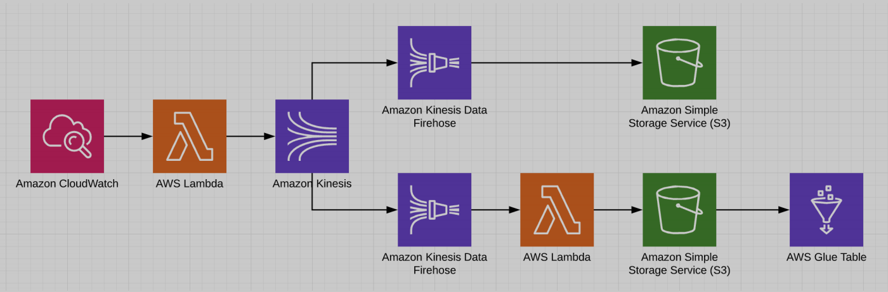

# Machine Learning Platform Engineer

O projeto consiste em implementar uma arquitetura completa que consome a Punk Api no
[endpoint](https://api.punkapi.com/v2/beers/random) e ingere em um Kinesis Stream que terá 2 consumidores.


Tabela de conteúdos
=================
<!--ts-->
   * [Sobre](#sobre)
   * [Arquitetura](#arquitetura)
   * [Instalação](#instalacao)
   * [Pré-Requisitos](#pre-requisitos)
   * [Como executar o projeto](#executar-terraform)
   * [Remote files](#remote-files)
   * [Multiple files](#multiple-files)
   * [Combo](#combo)
   * [Tests](#testes)
   * [Tecnologias](#tecnologias)
   * [Autor](#autor)
   * [Referências](#referencias)
   * [Licença](#licenca)
<!--te-->

<h4 align="center"> 
	🚧 🚀 Em construção...  🚧
</h4>


### Features

- [ ] Criação dos scripts Terraform 
- [x] Levantamento da arquitetura


# <a name="arquitetura"><a/> 🏢 Arquitetura

<h1 align="center">
  
</h1>

# <a name="instalacao"><a/> 👨‍💻 Instalação

- Instalação/Configuração AWS CLI
- Instalação/Configuração Terraform

# <a name="pre-requisitos"><a/> ☑️ Pré-Requisitos

- Criar conta na AWS
- Criação de usuário/grupo no AWS IAM
- Gerar Key e Secret para o usuário

Antes de começar, você vai precisar ter uma conta na AWS, para isso acesse [AWS Console](https://aws.amazon.com/).

Após criar a conta, será necessário a criação de um usuário e grupo, para realizar a geração da **acess_key** e **secret_key**,
necessárias para o credenciamento nos serviços AWS.

- Descrever como criar usuário e grupo e gerar chaves.

# <a name="executar-terraform"><a/> 🚀 Como executar o projeto (Terraform)

Navegue até o diretório onde os scripts terraform estão para executar os passos abaixo:

```bash
# Inicialize o projeto, que baixa um plug-in que permite ao Terraform interagir com o Docker.
$ terraform init

# O subcomando plan procura no diretório de trabalho atual para a configuração do módulo raiz. Exibe os serviços que serão criados
$ terraform plan

# Realiza a criação dos serviços nos scripts extensão .tf. Quando o Terraform solicitar que você confirme, digite yes e pressione Enter
$ terraform apply

# Para excluir os serviços, execute terraform destroy.
$ terraform destroy
```


# <a name="tecnologias"><a/> 🛠 Tecnologias

As seguintes linguagens foram usadas na construção do projeto:

- [Python](https://www.python.org/)
- [Terraform](https://www.terraform.io/)

#### Serverless

- [AWS Lambda](https://aws.amazon.com/en/lambda/)
- [Amazon Kinesis](https://aws.amazon.com/en/kinesis/)
- [Amazon Kinesis Data Firehose](https://aws.amazon.com/en/kinesis/data-firehose/)
- [AWS Glue](https://aws.amazon.com/pt/glue/)

#### Plataforma de Machine Learning

- [Amazon SageMaker](https://aws.amazon.com/en/sagemaker/)

#### Scheduler e monitoramento de serviços

- [Amazon Cloudwatch](https://aws.amazon.com/pt/cloudwatch/)


# <a name="autor"><a/> 🤓 Autor

Lucas Dynczuki

Entre em contato! 💚

[](https://www.linkedin.com/in/lucasdynczuki/) 
[](mailto:lucas.dynczuki@outlook.com)


# <a name="referencias"><a/>  📚 Referências

https://aws.amazon.com/pt/
https://aws.amazon.com/en/lambda/
https://aws.amazon.com/en/kinesis/data-streams/
https://aws.amazon.com/en/kinesis/data-firehose/
https://aws.amazon.com/en/glue/
https://aws.amazon.com/pt/cloudwatch/
https://aws.amazon.com/en/sagemaker/
https://learn.hashicorp.com/tutorials/terraform/install-cli?in=terraform/aws-get-started
https://learn.hashicorp.com/tutorials/terraform/aws-build?in=terraform/aws-get-started
https://registry.terraform.io/providers/hashicorp/aws/latest/docs/resources/lambda_function
https://registry.terraform.io/providers/hashicorp/aws/latest/docs/resources/kinesis_stream
https://registry.terraform.io/providers/hashicorp/aws/latest/docs/resources/kinesis_firehose_delivery_stream
https://registry.terraform.io/providers/hashicorp/aws/latest/docs/resources/glue_catalog_database
https://registry.terraform.io/providers/hashicorp/aws/latest/docs/resources/glue_catalog_table
https://registry.terraform.io/providers/hashicorp/aws/latest/docs/resources/cloudwatch_event_rule
https://registry.terraform.io/providers/hashicorp/aws/latest/docs/resources/cloudwatch_event_target
https://registry.terraform.io/providers/hashicorp/aws/latest/docs/resources/iam_policy
https://registry.terraform.io/providers/hashicorp/aws/latest/docs/resources/iam_role
https://registry.terraform.io/providers/hashicorp/aws/latest/docs/resources/iam_role_policy_attachment


# <a name="licenca"><a/>  📝 Licença

Este projeto esta sobe a licença [MIT](./LICENSE).
[](https://github.com/ldynczuki/MLPlatformEngineer/blob/main/LICENSE)