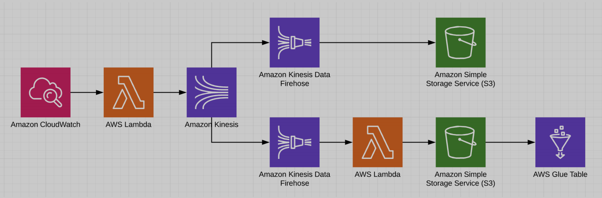
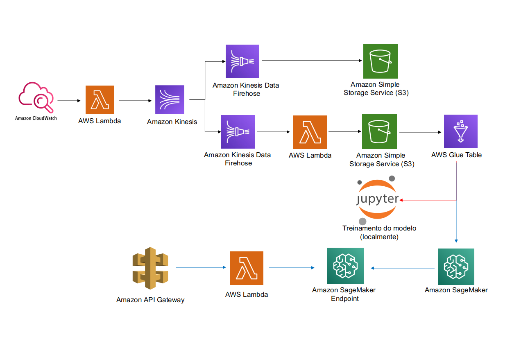
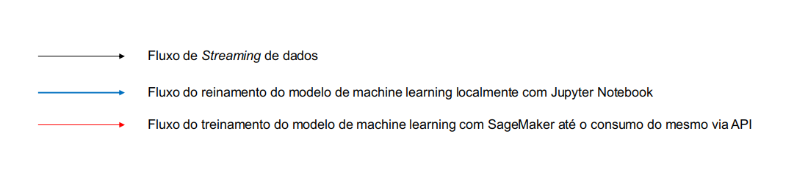

# Machine Learning Platform Engineer

O projeto consiste em implementar uma arquitetura completa que consome a Punk Api no
[endpoint](https://api.punkapi.com/v2/beers/random) e ingere em um Kinesis Stream que terá 2 consumidores.
Com os dados processados, treinar um modelo de machine learning e integrar à arquitetura.


Tabela de conteúdos
=================
<!--ts-->
   * [Sobre](#sobre)
   * [Arquitetura](#arquitetura)
   * [Pré-Requisitos](#pre-requisitos)
   * [Instalação](#instalacao)
   * [Como executar o projeto](#executar-terraform)
   * [Tecnologias](#tecnologias)
   * [Execução do Desafio](#execucao_desafio)
   * [Autor](#autor)
   * [Licença](#licenca)
   * [Referências](#referencias)
<!--te-->

<h4 align="center"> 
	🚧 🚀 Em construção...  🚧
</h4>


### Features

- [x] Levantamento da arquitetura sem integração do modelo
- [ ] Divisão dos dados em: treino, validação, test para SageMaker
- [ ] Criação dos scripts Terraform para SageMaker, API GateWay e Lambda que invoca o Endpoint
- [ ] Criação dos scripts Terraform
- [ ] Desenho da nova arquitetura com a integração do modelo 


# <a name="sobre"><a/> Sobre

O presente projeto tem como objetivo implementar uma arquitetura completa que consome a [Punk API](https://punkapi.com/) no endpoint
https://api.punkapi.com/v2/beers/random e ingere em um Kinesis Stream que terá 2 consumidores. 

Para isso você será necessário configurar:

   1. Um CloudWatch Event que dispara a cada 5 minutos uma função Lambda para alimentar o Kinesis Stream que terá como saída:
      * Um Firehose agregando todas as entradas para guardar em um bucket S3 com o nome de `raw`.

      * Outro Firehose com um Data Transformation que pega somente os `id`, `name`, `abv`, `ibu`, `target_fg`, `target_og`, `ebc`, `srm` e `ph` das cervejas e guarda em um outro bucket S3 com o nome de `cleaned` em formato **csv**.

   2. Crie uma tabela com os dados do bucket `cleaned`.

   3. Com base nos dados da tabela `cleaned`, treine um modelo de machine learning que classifique as cervejas em seus respectivos ibus.


# <a name="arquitetura"><a/> 🏢 Arquitetura

<h1 align="center">
  
</h1>


# <a name="pre-requisitos"><a/> ☑️ Pré-Requisitos


#### Criar conta na AWS
   * Antes de começar, você vai precisar ter uma conta na AWS, para isso acesse [AWS Console](https://aws.amazon.com/).

#### Criação de usuário/grupo no AWS IAM

   1. Entre no console da AWS e pesquise pelo serviço **IAM**;
   2. No menu à esquerda clique em "users";
   3. Clique no botão "add user";
      * Insira um nome para o usuário, no meu caso foi `admin`;
      * Em `Select AWS access type` marque a primeira caixa `Programmatic access Enables an access key ID and secret access key for the AWS API, CLI, SDK, and other development tools.`;
      * Clique em `Next:Permissions`;
      * Caso não tenha nenhum grupo já criado, clique em `create group`;
      * Na janela que abrir, insira um nome para o grupo, no meu caso foi `admin_group`;
      * Em `Filter Policies` marque a opção `AdministratorAccess` e clique em `Create group`;
      * Clique em `Next: Tags`;
      * Em `Add tags (optional)` não é necessário nenhum procedimento, apenas clique em `Next: Review`;
      * Será apresentado um sumário do usuário e grupo que serão criados, confira as informações e se estiverem de acordo com o desejado clique em `Create user`.


#### Criação de Acess key

Após criado o usuário no passo anterior, realize as seguintes etapas para criar as `acess_key`:

   1. Entre no console da AWS e pesquise pelo serviço **IAM**;
   2. No menu à esquerda clique em "users";
   3. Clique no usuário que você criou;
   4. Na janela que abrir, clique em `Security credentials`;
      * Clique em `Create acess key`;
      * As chaves de acesso serão geradas e deverá clicar para salvar o arquivo, pois a secret não será apresentada novamente.


# <a name="instalacao"><a/> 👨‍💻 Instalação

#### Instalação e Configuração do AWS CLI

   1. Neste projeto, estou utilizando o sistema operacional Linux. Utilize o seguinte roteiro para a instalação [instalação AWS CLI](https://linuxhint.com/install_aws_cli_ubuntu/)
   2. Com o AWS CLI instalado, você deverá configurar suas credenciais:
   ```bash
   # Execute o comando abaixo para iniciar a configuração
   $ aws configure
   ```
    * Insira a `Acess Key` e tecle Enter;
    * Insira a `Secret Key` e tecle Enter;
    * Insira o código da região, no meu caso é `sa-east-1`;
    * No valor formato de saída, pode deixar `None` e tecle Enter.

#### Instalação e Configuração do Terraform

   1. Clique no link para baixar o Terraform de acordo com seu sistema operacional [download Terraform](https://www.terraform.io/downloads.html):
      * No meu caso, estou utilizando Linux 64-bit, após clicar no link um arquivo será baixado.
   2. Descompacte o arquivo e execute os comandos abaixo: 
      * [Roteiro de Instalação](https://learn.hashicorp.com/tutorials/terraform/install-cli?in=terraform/aws-get-started)
   ```bash
    $ echo $PATH

   # Mova o arquivo terraform para o resultado do echo $PATH no comando anterior
   $ mv ~/Downloads/terraform /usr/local/bin/

   # Verifique a instalação do Terraform
   $ terraform -help
   ```

# <a name="executar-terraform"><a/> 🚀 Como executar o projeto (Terraform)

Navegue até o diretório onde os scripts terraform estão para executar os passos abaixo:

```bash
# Inicialize o projeto.
$ terraform init

# Exibe um plano dos serviços que serão criados.
$ terraform plan

# Caso queira salvar o plano de execução dos serviços, substitua "path" por um caminho válido.
$ terraform plan -out=path 

# Realiza a criação dos serviços nos scripts extensão .tf. 
# Quando o Terraform solicitar que você confirme, digite yes e pressione Enter.
$ terraform apply

# Para excluir os serviços, execute terraform destroy.
$ terraform destroy
```


# <a name="tecnologias"><a/> 🛠 Tecnologias

As seguintes linguagens foram usadas na construção do projeto:

- [Python](https://www.python.org/)
- [Terraform](https://www.terraform.io/)

#### Serverless

- [AWS Lambda](https://aws.amazon.com/en/lambda/)
- [Amazon Kinesis](https://aws.amazon.com/en/kinesis/)
- [Amazon Kinesis Data Firehose](https://aws.amazon.com/en/kinesis/data-firehose/)
- [AWS Glue](https://aws.amazon.com/en/glue/)

#### Plataforma de Machine Learning

- [Amazon SageMaker](https://aws.amazon.com/en/sagemaker/)

#### Scheduler e monitoramento de serviços

- [Amazon Cloudwatch](https://aws.amazon.com/en/cloudwatch/)


#### API REST

 - [Amazon API Gateway](https://aws.amazon.com/en/api-gateway/)


# <a name="execucao_desafio"><a/> ❕Execução do Desafio

Siga os passos abaixo para a entrega do desafio:

   1. Criar uma conta gratuita na `AWS`.

   2. Você deve utilizar `Terraform` para construir a arquitetura de uma maneira reproduzível em outras contas.

   3. Todas as funções `Lambdas` devem ser desenvolvidas em `Python` assim como o modelo de machine learning.

   4. O modelo de machine learning deve ser apresentado em um Jupyter Notebook, local ou remoto. O arquivo do notebook estar no repositório do github.

   5. Bônus (não obrigatório): Integre o modelo de machine learning em sua arquitetura.


## Arquitetura da implementação

<h1 align="center">
  
</h1>

### **Legenda**

<h1 align="left">
  
</h1>

### Detalhes da implementação

<span style="color:red">teste</span>
**Item 2. Para acessar o diretório onde estão os scripts `Terraform` clique [aqui](https://github.com/ldynczuki/MLPlatformEngineer/tree/main/code/terraform)**

**Item 3. Para acessar o diretório onde estão as funções `Lambdas` desenvolvidas em `Python` clique [aqui](https://github.com/ldynczuki/MLPlatformEngineer/tree/main/code/terraform)**:
* Para a implementação do desafio, as funções `Lambda` foram compactadas em formato .zip e possuem os seguintes nomes: `lambda_data_processing.zip`, `lambda_data_processing.zip` e `lambda_call_endpoint.zip`.

**Item 4. Treinamento do modelo de machine learning (local):**
* Conforme apresentado o item 4., foi realizado o treinamento de um modelo de machine learning (local), o qual foi utilizado o Jupyter Notebook, onde é possível acessá-lo clicando [aqui](https://github.com/ldynczuki/MLPlatformEngineer/blob/main/code/models/local-notebook/model-ml-platform.ipynb). 
* Nesta etapa, criei um objeto client do `AWS Glue` para encontrar a tabela `cleaned` e a localização da fonte de dados transformados `bucket S3`. 
* Após encontrar a localização dos dados, criei um DataFrame dos dados do `bucket S3` e iniciei a análise exploratório dos dados, onde foi possível verificar que a feature `abv` é a que possui maior correlação com a nossa coluna target `ibu`. Deste modo, irei realizar 2 treinamentos, o primeiro utilizando todas as features e outro treinamento apenas com a feature `abv` e irei comparar os resultados finais.
* Antes do treinamento do modelo é essencial realizar o pré-processamento dos dados, onde foram eliminadas as colunas não utilizadas para o treinamento, tais como `id` e `name`, apliquei também uma conversão destes dados para **numpy array** com o tipo de dados float32 e, por fim, a divisão da base de dados em treinamento e teste, em uma proporção de 80% e 20%, respectivamente.
* Com os dados pré-processados, realizei o treinamento do modelo utilizando a técnica de regressão linear múltipla e simples.
* Posteriormente o treino dos modelos, foi realizada a avaliação dos modelos utilizando as seguintes métricas: **MAE** (_Mean Absolute Error_), **MSE** (_Mean Squared Error_), **RMSE** (_Root Mean Squared Error_) e	**R2 Square**.
* Foi possível observar no DataFrame final dos resultados que o modelo de regressão linear múltipla obteve um melhor resultado.
* É importante salientar que, com a baixa quantidade de amostras distintas não foi possível obter um bom resultado durante o treinamento e que também existem outras técnicas de machine learning que podem alcançar melhores métricas. Todavia, o objetivo deste treinamento foi acessar os metadados do `AWS Glue`, obter a localização e os dados no `bucket S3` e realizar o treinamento.


# <a name="autor"><a/> 🤓 Autor

Lucas Dynczuki

Entre em contato! 💚

[](https://www.linkedin.com/in/lucasdynczuki/) 
[](mailto:lucas.dynczuki@outlook.com)


# <a name="licenca"><a/>  📝 Licença

[](https://github.com/ldynczuki/MLPlatformEngineer/blob/main/LICENSE)


Este projeto esta sobe a licença [MIT](./LICENSE).


# <a name="referencias"><a/>  📚 Referências

https://aws.amazon.com/en/
https://aws.amazon.com/en/cli/
https://aws.amazon.com/en/lambda/
https://aws.amazon.com/en/kinesis/data-streams/
https://aws.amazon.com/en/kinesis/data-firehose/
https://aws.amazon.com/en/glue/
https://aws.amazon.com/pt/cloudwatch/
https://aws.amazon.com/en/sagemaker/
https://www.terraform.io/downloads.html
https://learn.hashicorp.com/tutorials/terraform/install-cli?in=terraform/aws-get-started
https://learn.hashicorp.com/tutorials/terraform/aws-build?in=terraform/aws-get-started
https://registry.terraform.io/providers/hashicorp/aws/latest/docs/resources/lambda_function
https://registry.terraform.io/providers/hashicorp/aws/latest/docs/resources/kinesis_stream
https://registry.terraform.io/providers/hashicorp/aws/latest/docs/resources/kinesis_firehose_delivery_stream
https://registry.terraform.io/providers/hashicorp/aws/latest/docs/resources/glue_catalog_database
https://registry.terraform.io/providers/hashicorp/aws/latest/docs/resources/glue_catalog_table
https://registry.terraform.io/providers/hashicorp/aws/latest/docs/resources/cloudwatch_event_rule
https://registry.terraform.io/providers/hashicorp/aws/latest/docs/resources/cloudwatch_event_target
https://registry.terraform.io/providers/hashicorp/aws/latest/docs/resources/iam_policy
https://registry.terraform.io/providers/hashicorp/aws/latest/docs/resources/iam_role
https://registry.terraform.io/providers/hashicorp/aws/latest/docs/resources/iam_role_policy_attachment
https://linuxhint.com/install_aws_cli_ubuntu/
https://michael-timbs.medium.com/linear-regression-with-aws-sagemaker-15feefb19342
https://towardsdatascience.com/using-aws-sagemakers-linear-learner-to-solve-regression-problems-36732d802ba6
https://aws.amazon.com/pt/blogs/machine-learning/creating-a-machine-learning-powered-rest-api-with-amazon-api-gateway-mapping-templates-and-amazon-sagemaker/
https://aws.amazon.com/pt/blogs/machine-learning/call-an-amazon-sagemaker-model-endpoint-using-amazon-api-gateway-and-aws-lambda/
https://medium.com/analytics-vidhya/invoke-an-amazon-sagemaker-endpoint-using-aws-lambda-83ff1a9f5443
https://medium.com/@gisely.alves/visualiza%C3%A7%C3%A3o-de-dados-com-seaborn-2fd0defd9adb
https://docs.aws.amazon.com/sagemaker/latest/dg/xgboost.html